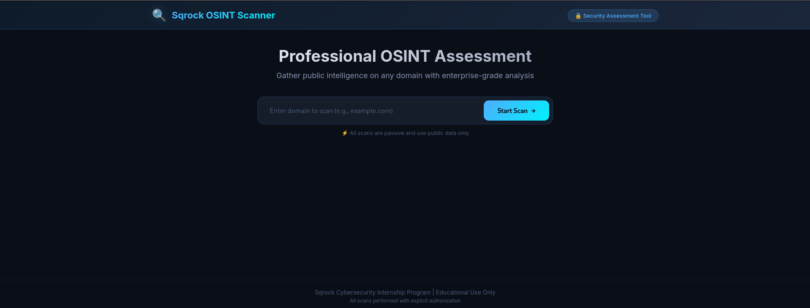
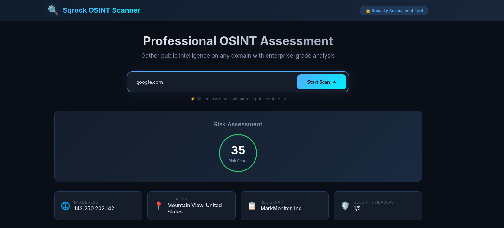
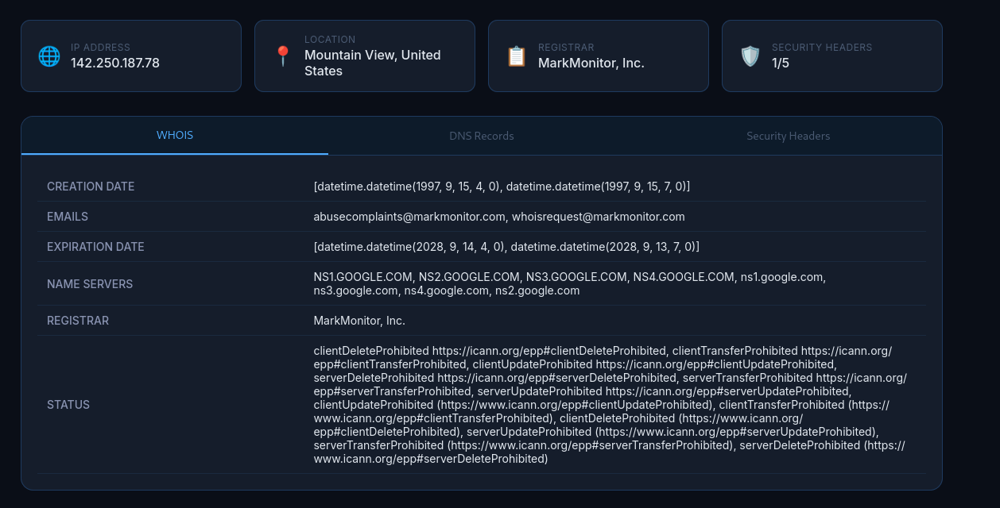

<div align="center">

# 🔍 Day 1: OSINT & Passive Reconnaissance

## Professional OSINT Scanner with Web Interface

[](https://www.python.org/)
[](https://flask.palletsprojects.com/)
[](LICENSE)

</div>

---

# 🎯 Overview

This is a professional **OSINT (Open-Source Intelligence) Scanner** built as Day 1 of the SQR CyberSecurity Internship program. It performs passive reconnaissance on domains using public data sources.

### What is OSINT?
OSINT (Open-Source Intelligence) is the collection and analysis of information from publicly available sources. This tool demonstrates ethical reconnaissance techniques used by security professionals.

### Key Capabilities:
- 🔍 **WHOIS Lookup** - Domain registration information
- 🌐 **DNS Enumeration** - A, MX, NS, TXT records
- 📍 **IP Geolocation** - Server location tracking
- 🛡️ **Security Headers** - Security posture analysis
- 📊 **Risk Scoring** - Automated security assessment (0-100)

---

# ✨ Features

### 🔍 OSINT Scanner
| Feature | Description |
|---------|-------------|
| **WHOIS Lookup** | Registrar, creation date, expiration date, name servers |
| **DNS Enumeration** | A, MX, NS, TXT records |
| **IP Geolocation** | Country, city, ISP, organization |
| **Security Headers** | HSTS, CSP, X-Frame-Options, X-Content-Type-Options |
| **Risk Score** | Automated security assessment (0-100) |

### 🌐 Web Interface
| Feature | Description |
|---------|-------------|
| **Dark Theme** | Professional cybersecurity aesthetic |
| **Real-time Progress** | Live scan status tracking |
| **Interactive Tabs** | WHOIS, DNS, Security Headers |
| **Download Reports** | JSON and Markdown formats |
| **Responsive Design** | Works on all devices |

### 📊 Reporting
| Feature | Description |
|---------|-------------|
| **Markdown Reports** | Human-readable format |
| **JSON Data** | Machine-readable format |
| **Risk Assessment** | Automated scoring |
| **Recommendations** | Actionable security insights |

---

# 📸 Screenshots

### Professional Dashboard:
<p align="center">
  
</p>

### Live Scan in Action:
<p align="center">
  
</p>

### Detailed Results:
<p align="center">
  
</p>


---

# 🚀 Installation

### Prerequisites
- Python 3.9+
- Kali Linux (recommended) or Windows 10/11

### Quick Start

```bash
 # Clone the repository
git clone https://github.com/warshia-rubab/sqrock-cybersecurity-internship.git
cd sqrock-cybersecurity-internship/"Day-1-OSINT-Reconnaissance"

# Create virtual environment
python3 -m venv venv
source venv/bin/activate  # On Windows: venv\Scripts\activate

# Install dependencies
pip install flask flask-cors python-whois requests dnspython

# Run the web application
cd web_app
python3 app.py

# Open browser: http://localhost:5000
Docker Deployment (Optional)
docker build -t osint-scanner .
docker run -p 5000:5000 osint-scanner

```

### 💻 Usage

```
# Web Interface
Open browser: http://localhost:5000
Enter domain (e.g., google.com)
Click "Start Scan"
View results!

# Command Line
# Run scanner directly
python3 osint_scanner.py
# Enter domain when prompted
```
---

# 📁 Project Structure

```
Day-1-OSINT-Reconnaissance/
│
├── 📁 src/
│   └── 🐍 osint_scanner.py          # Core OSINT scanner
│
├── 📁 web_app/                       # Flask Web Application
│   ├── 📄 app.py                     # Main application
│   ├── 📁 templates/
│   │   └── 📄 index.html             # Main page
│   └── 📁 static/
│       ├── 📁 css/
│       │   └── 📄 style.css          # Professional styling
│       └── 📁 js/
│           └── 📄 script.js          # Frontend logic
│
├── 📁 reports/                       # Generated reports
│   ├── 📄 osint_report_*.md
│   └── 📄 osint_data_*.json
│
├── 📁 screenshots/                   # Documentation
│   ├── Dashoard.png
│   ├── Working.png
│   ├── assesments.png
│   └── google_scan.png
│
├── 📄 README.md                      # This file
└── 📄 requirements.txt               # Dependencies
```
---

# 📊 Example Results
### Google.com Scan:
```
🔍 Scanning: google.com
============================================================
📊 SCAN SUMMARY
============================================================
Domain: google.com
Risk Score: 35/100
IP Address: 142.250.202.142
Location: Mountain View, United States
Registrar: MarkMonitor, Inc.
Creation Date: 1997-09-15
Security Headers: 1/5
============================================================
```

### Example.com Scan:
```
🔍 Scanning: example.com
============================================================
📊 SCAN SUMMARY
============================================================
Domain: example.com
Risk Score: 30/100
IP Address: 93.184.216.34
Location: Los Angeles, United States
Registrar: Example Registrar, Inc.
============================================================
```
---
# 📊 Detailed WHOIS Data

| Field | Google.com | Example.com |
|-------|------------|-------------|
| **Creation Date** | 1997-09-15 | 1995-08-14 |
| **Expiration Date** | 2028-09-14 | 2025-08-13 |
| **Registrar** | MarkMonitor, Inc. | Example Registrar |
| **Name Servers** | ns1.google.com, ns2.google.com, ns3.google.com, ns4.google.com | a.iana-servers.net |
| **Domain Age** | 27+ years | 29+ years |
| **Status** | clientDeleteProhibited, clientTransferProhibited, serverDeleteProhibited, serverTransferProhibited | clientDeleteProhibited, clientTransferProhibited |
| **Emails** | abusecomplaints@markmonitor.com, whoisrequest@markmonitor.com | N/A |

---

## 🛠️ Technologies Used

### Backend Technologies

| Technology | Version | Purpose |
|------------|---------|---------|
| **Python** | 3.9+ | Core programming language |
| **Flask** | 2.3+ | Web framework |
| **python-whois** | 0.7+ | WHOIS queries and domain information |
| **requests** | 2.31+ | HTTP requests for IP geolocation |
| **dnspython** | 2.4+ | DNS record enumeration |
| **BeautifulSoup4** | 4.12+ | HTML parsing for email harvesting |

### Frontend Technologies

| Technology | Version | Purpose |
|------------|---------|---------|
| **HTML5** | - | Page structure |
| **CSS3** | - | Styling and dark theme |
| **JavaScript** | ES6+ | Dynamic functionality |
| **Inter Font** | - | Professional typography |

### 🔒 Security Libraries

| Library | Purpose |
|---------|---------|
| **python-whois** | WHOIS queries for domain registration data |
| **dnspython** | DNS enumeration (A, MX, NS, TXT records) |
| **requests** | HTTP requests for IP geolocation API |
| **socket** | IP address resolution |
| **ssl** | SSL/TLS certificate analysis |
| **re** | Regular expressions for pattern matching |

### Development & Deployment

| Tool | Purpose |
|------|---------|
| **Git** | Version control |
| **GitHub** | Repository hosting |
| **Kali Linux** | Testing environment |
| **VirtualBox** | Virtual machine |
| **OBS Studio** | Screen recording |
| **Docker** | Containerization (optional) |

---

# ⚖️ Ethical Guidelines

⚠️ IMPORTANT: Educational Use Only

This tool is for educational purposes in authorized environments only.

### Rules:

✅ Use only on your own domains or authorized test environments

✅ All data must be anonymized after analysis

✅ Never target real users or organizations

✅ Follow all applicable laws (IT Act 2000, CFAA, GDPR)

### Authorized Environments:

✅ Local VMs (VirtualBox, VMware)

✅ Lab environments with written authorization

✅ Your own domains

✅ CTF/Training platforms

---

# 🚨 Troubleshooting

### Port 5000 Already in Use
```bash
sudo fuser -k 5000/tcp
python3 app.py
Module Not Found
```
```bash
pip install flask flask-cors python-whois requests dnspython
Reports Not Saving
```
```bash
mkdir -p reports data
chmod 755 reports data
DNS Resolution Error
```
```bash
echo "nameserver 8.8.8.8" | sudo tee /etc/resolv.conf
```
---

# 🎓 Learning Outcomes

✅ Understanding of OSINT techniques

✅ Python programming skills

✅ Web development with Flask

✅ Security assessment methodologies

✅ Professional documentation

✅ Risk scoring and analysis

---
# 📝 License

This project is licensed under the MIT License.

---

# 🔗 Quick Links

| Link | Description |
|------|-------------|
| [YouTube Demo](https://youtu.be/AaLgISurWJs) | Video walkthrough of Day 1 |
| [Day 1: OSINT Scanner](https://github.com/warshia-rubab/sqrock-cybersecurity-internship/tree/main/Day-1-OSINT-Reconnaissance) | Complete Day 1 implementation |
| [License](https://github.com/warshia-rubab/sqrock-cybersecurity-internship/blob/main/LICENSE) | MIT License |

---

