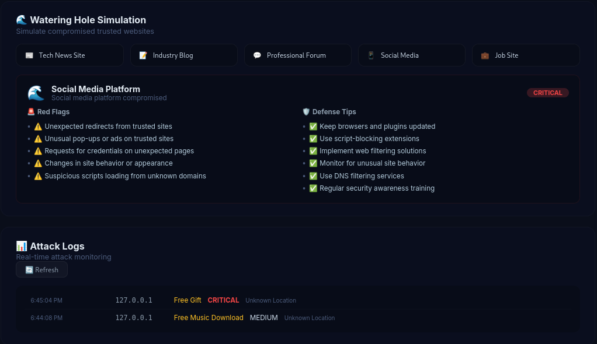
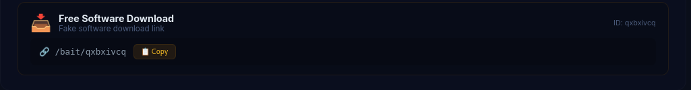
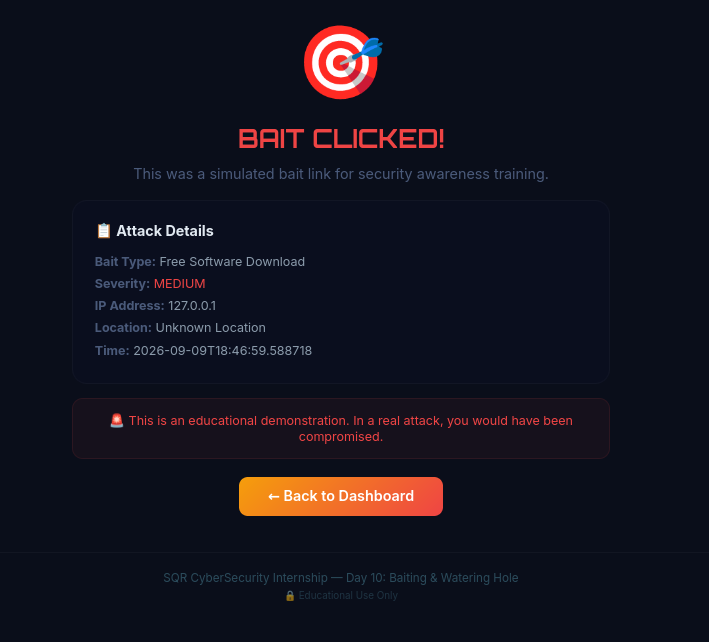
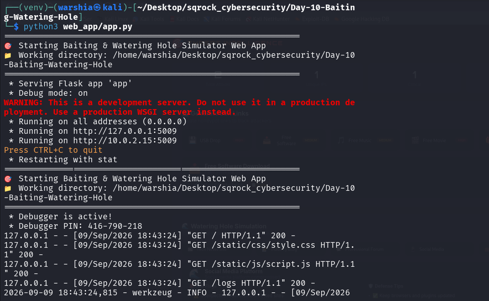

<div align="center">

# 🎯 BAITING & WATERING HOLE SIMULATOR *Honeypot & Attack Tracking System*

[](https://www.python.org/)
[](https://flask.palletsprojects.com/)
[](LICENSE)
[]()

</div>

---

# 📌 EXECUTIVE SUMMARY

| | |
|---|---|
| **Project** | Baiting & Watering Hole Simulator |
| **Purpose** | Security Awareness & Attack Tracking |
| **Technologies** | Python, Flask, Honeypot |
| **Status** | ✅ Complete |


> *"Simulates baiting attacks with honeypot links and watering hole compromises for security awareness training."*

---

# 🎬 LIVE DEMO

> **📹 Video Demonstration** — Complete walkthrough of Day 10

<p align="center">
  <video src="https://github.com/warshia-rubab/sqrock-cybersecurity-internship/raw/main/Day-10-Baiting-Watering-Hole/demo.mp4" controls width="80%">
    Your browser does not support the video tag.
  </video>
</p>

<p align="center">
  <a href="https://github.com/warshia-rubab/sqrock-cybersecurity-internship/blob/main/Day-10-Baiting-Watering-Hole/demo.mp4">
    📥 Download Video
  </a>
  &nbsp;·&nbsp;
</p>

---

# 📸 SCREENSHOTS

### Dashboard Overview
<p align="center">
  
</p>

### Bait Link Generation
<p align="center">
  
</p>

### Bait Clicked - Attack Logged
<p align="center">
  
</p>

### Server Logs
<p align="center">
  
</p>

---

# ⚙️ FEATURES AT A GLANCE

### 💾 Bait Types

| Bait | Icon | Severity | Description |
|------|------|----------|-------------|
| **USB Drop** | 💾 | HIGH | USB drive left in parking lot |
| **Free Software** | 📥 | MEDIUM | Fake software download link |
| **Free Music** | 🎵 | MEDIUM | Fake music download link |
| **Free Movie** | 🎬 | HIGH | Fake movie streaming link |
| **Free Gift** | 🎁 | CRITICAL | Fake gift giveaway link |

### 🌊 Watering Hole Targets

| Target | Icon | Description |
|--------|------|-------------|
| Tech News Site | 📰 | Popular tech news site compromised |
| Industry Blog | 📝 | Industry-specific blog compromised |
| Professional Forum | 💬 | Professional forum compromised |
| Social Media | 📱 | Social media platform compromised |
| Job Site | 💼 | Job search website compromised |

### 📊 Attack Tracking

- ✅ Real-time attack logging
- ✅ IP address tracking
- ✅ Location detection
- ✅ Severity classification
- ✅ Attack statistics dashboard

---

## 🚀 DEPLOYMENT

### One-Line Setup

```bash
git clone https://github.com/warshia-rubab/sqrock-cybersecurity-internship.git &&
cd sqrock-cybersecurity-internship/Day-10-Baiting-Watering-Hole && python3 -m venv venv &&
source venv/bin/activate && pip install -r requirements.txt && python3 web_app/app.py
```
---
# 💻 System Requirements

| Component | Requirement |
|-----------|-------------|
| **Operating System** | Kali Linux / Ubuntu / Windows 10/11 |
| **Python Version** | 3.9 or higher |
| **RAM** | 2GB minimum (4GB recommended) |
| **Storage** | 500MB free space |
| **Browser** | Chrome, Firefox, Edge (latest versions) |
| **Internet** | Required for API calls |

---
# 💻 USAGE

#### Generate Bait Links

1. Click any bait button (USB Drop, Free Software, etc.)

2. Copy the generated link

3. Open the link in a new tab

4. View the attack logged in real-time!

#### Simulate Watering Hole

1. Click any watering hole target

2. View the simulation details

3. Review red flags and defense tips

#### View Attack Logs

1. Click "Refresh" to update

2. See IP, location, bait type, severity

3. Real-time attack monitoring

---

# 📊 SAMPLE OUTPUT

#### Bait Link Generation

```text
💾 Free Software Download
   URL: /bait/qxbxivcq
   Severity: MEDIUM
   ID: qxbxivcq

📋 Attack Logged:
   Timestamp: 2026-09-09 18:46:59
   IP: 127.0.0.1
   Location: Unknown Location
   Bait: Free Software Download
   Severity: MEDIUM
```

#### Watering Hole Simulation
```text
🌊 Watering Hole Attack

Target: Social Media Platform
Description: Social media platform compromised
Risk: CRITICAL

🚨 Red Flags:
   ⚠️ Unexpected redirects from trusted sites
   ⚠️ Unusual pop-ups or ads on trusted sites
   ⚠️ Requests for credentials on unexpected pages

🛡️ Defense Tips:
   ✅ Keep browsers and plugins updated
   ✅ Use script-blocking extensions
   ✅ Implement web filtering solutions
```
---

# 🛠️ Technology Stack

| Layer | Technologies |
|-------|--------------|
| **Backend** | Python 3.9+, Flask |
| **Frontend** | HTML5, CSS3, JavaScript |
| **Theme** | Cyber Threat Intelligence |
| **Fonts** | Orbitron, Inter |

---
# 📁 PROJECT STRUCTURE
```text
Day-10-Baiting-Watering-Hole/
├── 📁 src/
│   └── baiting_simulator.py
├── 📁 web_app/
│   ├── app.py
│   ├── 📁 templates/
│   │   ├── index.html
│   │   └── bait.html
│   └── 📁 static/
│       ├── 📁 css/
│       │   └── style.css
│       └── 📁 js/
│           └── script.js
├── 📁 screenshots/
│   ├── D.png
│   ├── Link.png
│   ├── W.png
│   └── L.png
├── 🎬 demo.mp4
├── 📄 README.md
├── 📄 .gitignore
└── 📄 requirements.txt
```
---
# ⚖️ ETHICAL GUIDELINES
#### Rule	Description

Educational Use Only	Never use for malicious purposes

Authorized Systems	Only on lab/authorized environments

No Real Targets	Never target real users/organizations

Legal Compliance	Follow IT Act 2000, CFAA, GDPR

---

<div align="center">
SQR CyberSecurity Internship — Day 10


</div> 
