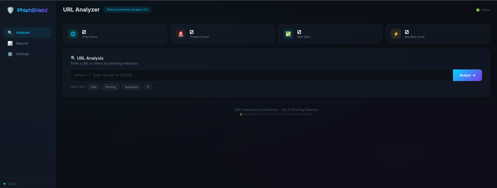
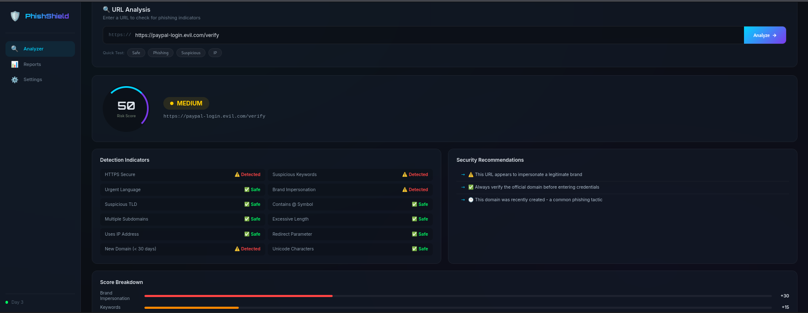
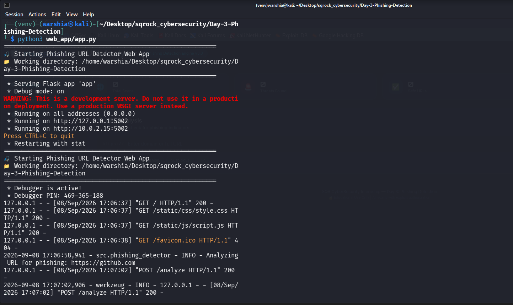

<div align="center">

# 🎯 PHISHSHIELD

## *URL Phishing Detection Engine*

[](https://www.python.org/)
[](https://flask.palletsprojects.com/)
[](LICENSE)

</div>

---

## 📌 Quick Overview

| **Day** | **Topic** | **Status** |
|---------|-----------|------------|
| 3 | Phishing URL Detection | ✅ Complete |

**What it does:** Analyzes URLs for phishing indicators using 12+ detection factors and provides real-time risk scoring.

---

## 🎬 Live Demo

> **📹 Video Demonstration** — Watch the complete walkthrough of Day 3

<p align="center">
  <video src="https://github.com/warshia-rubab/sqrock-cybersecurity-internship/raw/main/Day-3-Phishing-Detection/demo.mp4" controls width="80%">
    Your browser does not support the video tag.
  </video>
</p>

<p align="center">
  <a href="https://github.com/warshia-rubab/sqrock-cybersecurity-internship/blob/main/Day-3-Phishing-Detection/demo.mp4">
    📥 Download Video
  </a>
  &nbsp;·&nbsp;
</p>
---

## 📸 Screenshots

| Dashboard | Assessment | Logs |
|-----------|------------|------|
|  |  |  |

---

## ⚡ Features

### Detection Engine
✅ HTTPS Validation ✅ Brand Impersonation
✅ Suspicious Keywords ✅ Urgent Language
✅ Domain Age Check ✅ Suspicious TLD
✅ URL Structure Analysis ✅ IP Address Detection
✅ Redirect Parameters ✅ Unicode/Homograph Attacks

text

### Risk Levels
🟢 LOW 0-20 → Safe to proceed
🟡 MEDIUM 21-50 → Proceed with caution
🟠 HIGH 51-80 → Do not click, report
🔴 CRITICAL 81-100 → Block immediately

text

---

## 🚀 Installation

```bash
# Clone
git clone https://github.com/warshia-rubab/sqrock-cybersecurity-internship.git
cd sqrock-cybersecurity-internship/Day-3-Phishing-Detection

# Setup
python3 -m venv venv
source venv/bin/activate
pip install -r requirements.txt

# Run
python3 web_app/app.py
Open: http://localhost:5002

🧪 Test URLs
URL	Expected
https://github.com	🟢 LOW
https://paypal-login.evil.com/verify	🔴 HIGH
http://login-bank-verification.top	🔴 HIGH
https://193.23.45.6/login	🔴 HIGH
📊 Example Output
text
URL: https://paypal-login.evil.com/verify
Risk Score: 75/100
Risk Level: HIGH

Issues:
⚠️ Brand Impersonation (PayPal)
⚠️ Suspicious Keywords (login, verify)
⚠️ New Domain (< 30 days)

Recommendations:
🚨 DO NOT click - phishing attempt!
📧 Report to security team immediately
🛠️ Technologies
Layer	Tools
Backend	Python 3.9+, Flask, WHOIS, DNS
Frontend	HTML5, CSS3 (Glassmorphism), JavaScript
Security	SSL/TLS, Domain Analysis, Pattern Matching
📁 Project Structure
text
Day-3-Phishing-Detection/
├── src/
│   └── phishing_detector.py
├── web_app/
│   ├── app.py
│   ├── templates/
│   │   └── index.html
│   └── static/
│       ├── css/style.css
│       └── js/script.js
├── screenshots/
│   ├── Dashboard.png
│   ├── Assesments.png
│   └── Logs.png
├── README.md
├── .gitignore
└── requirements.txt
🔗 Links
📺 YouTube Demo	🐙 GitHub Repo
📁 Day 1: OSINT	📧 Day 2: Email Harvester
⚖️ Ethical Notice
⚠️ Educational Use Only — All tests must be performed on authorized environments only.

<div align="center">
SQR CyberSecurity Internship — Day 3

Last Updated: September 2024

</div> ```
