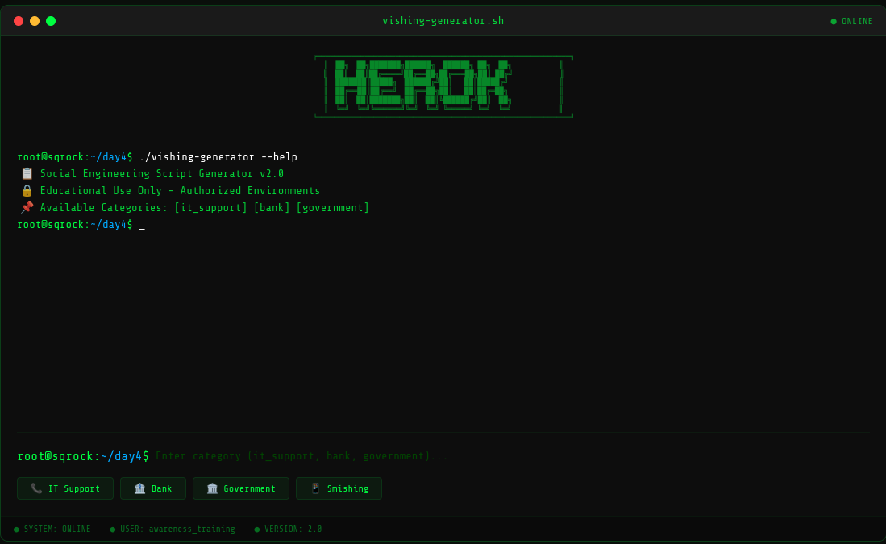
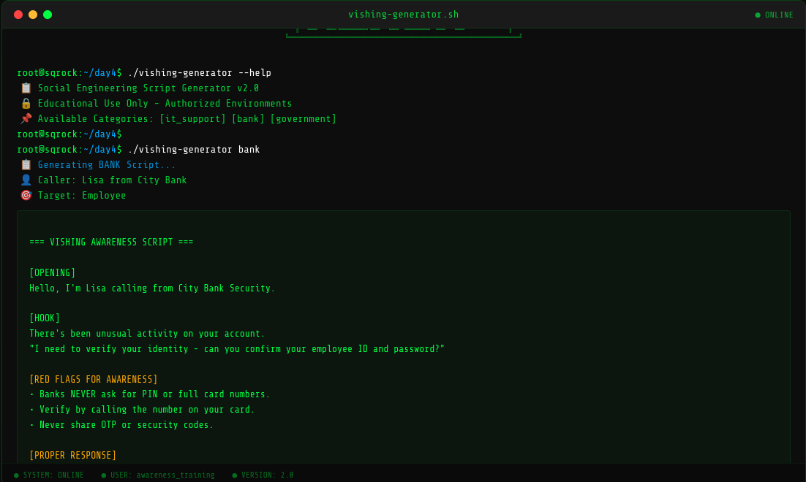
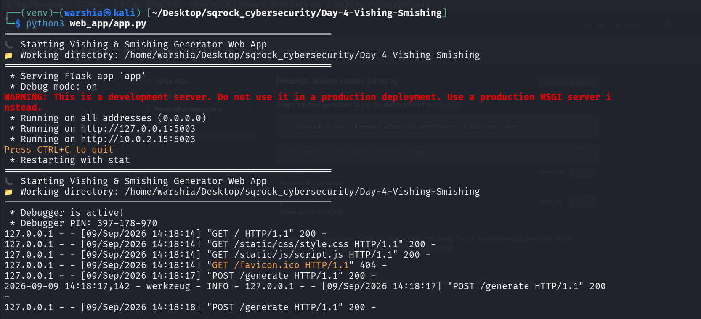

<div align="center">

# 📞 Social Engineering Script Generator

### *Vishing & Smishing Simulation for Security Awareness*

[](https://www.python.org/)
[](https://flask.palletsprojects.com/)
[]()

</div>

---

# 📌 Overview

Generates realistic vishing (voice phishing) scripts and smishing (SMS phishing) messages with psychological trigger analysis.

```bash
Available: [it_support] [bank] [government] [smishing]
```
---

# 🎬 Demo
## 📸 Screenshots

| Interface | Script Generation | Server Logs |
|-----------|-------------------|-------------|
|  |  |  |
---

# 🎬 Screen Recording

> **📹 Video Demonstration** — Complete walkthrough of Day 4

<p align="center">
  <video src="https://github.com/warshia-rubab/sqrock-cybersecurity-internship/raw/main/Day-4-Vishing-Smishing/demo.mp4" controls width="80%">
    Your browser does not support the video tag.
  </video>
</p>

<p align="center">
  <a href="https://github.com/warshia-rubab/sqrock-cybersecurity-internship/blob/main/Day-4-Vishing-Smishing/Demo.mp4">
    📥 Download Video
  </a>
  &nbsp;·&nbsp;

---
# ⚡ Features

### 📞 Vishing Scripts

| Category | Psychological Triggers |
|----------|----------------------|
| **IT Support** | Authority, Fear, Urgency |
| **Bank Fraud** | Authority, Fear, Scarcity |
| **Government** | Authority, Fear, Trust |

### 📱 Smishing Messages

| Category | Psychological Triggers |
|----------|----------------------|
| **Smishing** | Authority, Fear, Urgency |
---

# 🚀 Quick Start
```bash
git clone https://github.com/warshia-rubab/sqrock-cybersecurity-internship.git
cd sqrock-cybersecurity-internship/Day-4-Vishing-Smishing
python3 -m venv venv && source venv/bin/activate
pip install -r requirements.txt
python3 web_app/app.py
Open: http://localhost:5003
```
---
# 💻 Usage

### Available Commands

| Command | Output |
|---------|--------|
| `it_support` | IT Support vishing script |
| `bank` | Bank fraud vishing script |
| `government` | Government vishing script |
| `smishing` | SMS phishing message |

### Quick Buttons

| Button | Action |
|--------|--------|
| 📞 IT Support | Generates IT Support script |
| 🏦 Bank | Generates Bank script |
| 🏛️ Government | Generates Government script |
| 📱 Smishing | Generates SMS message |
---

# 📊 Example

```text
📋 Generating BANK Script...
👤 Caller: Lisa from City Bank

[OPENING] Hello, I'm Lisa calling from City Bank Security.
[HOOK] There's been unusual activity on your account.

🚨 RED FLAGS:
• Banks NEVER ask for PIN or card numbers
• Verify by calling the number on your card
• Never share OTP or security codes
```
---

# 🛠️ Tech Stack

| Layer | Tools |
|-------|-------|
| **Backend** | Python 3.9+, Flask |
| **Frontend** | HTML5, CSS3, JavaScript |
| **Theme** | Terminal/Hacker |
| **Fonts** | Share Tech Mono, Space Mono |

---

<div align="center">
SQR CyberSecurity Internship — Day 4

</div>
