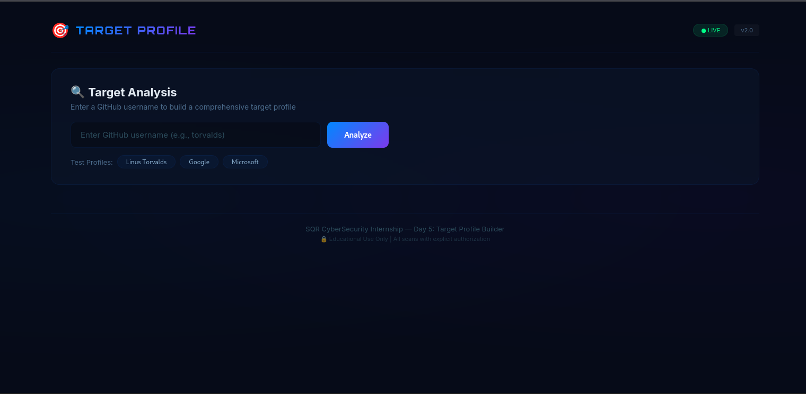
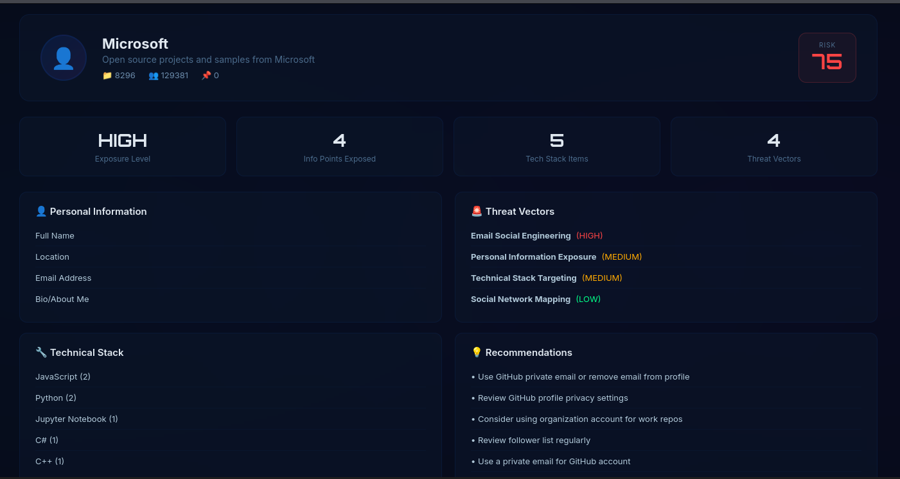
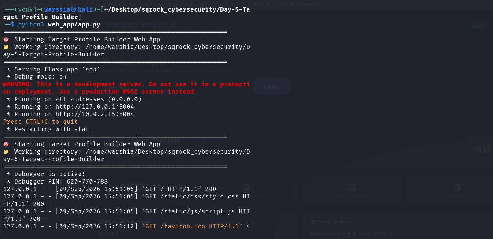

<div align="center">

# 🎯 Target Profile Builder *OSINT + Social Engineering Threat Assessment*

[](https://www.python.org/)
[](https://flask.palletsprojects.com/)
[]()

</div>

---

# 📌 Overview

Aggregates public GitHub data to build comprehensive target profiles for security awareness training.

---

# 🎬 Demo

> **📹 Video Demonstration** — Complete walkthrough of Day 5

<p align="center">
  <video src="https://github.com/warshia-rubab/sqrock-cybersecurity-internship/raw/main/Day-5-Target-Profile-Builder/demo.mp4" controls width="80%">
    Your browser does not support the video tag.
  </video>
</p>

<p align="center">
  <a href="https://github.com/warshia-rubab/sqrock-cybersecurity-internship/blob/main/Day-5-Target-Profile-Builder/demo.mp4">
    📥 Download Video
  </a>
  &nbsp;·&nbsp;
</p>

---

# 📸 Screenshots

| Dashboard | Results | Risk |
|-----------|---------|------|
|  |  |  |

---

# ⚡ Features

| Category | Feature |
|----------|---------|
| **Data Collection** | GitHub profile, repos, languages, followers |
| **Risk Assessment** | Personal info, tech stack, threat vectors, recommendations |

---

# 🚀 Quick Start

```bash
git clone https://github.com/warshia-rubab/sqrock-cybersecurity-internship.git
cd sqrock-cybersecurity-internship/Day-5-Target-Profile-Builder
python3 -m venv venv && source venv/bin/activate
pip install -r requirements.txt
python3 web_app/app.py
Open: http://localhost:5004
```
---

# 💻 Test Profiles

| Command | Output |
|---------|--------|
| `torvalds` | Linus Torvalds profile |
| `google` | Google org profile |
| `microsoft` | Microsoft org profile |
| `github` | GitHub org profile |

---

# 📊 Sample Output
```text
👤 Target: torvalds
📛 Name: Linus Torvalds
📊 Risk Score: 45/100
⚠️ Exposure Level: MEDIUM

🔍 Personal Info Exposed: Name, Location, Company, Bio
🚨 Threat Vectors: Personal Info (MEDIUM), Tech Stack (MEDIUM)
💡 Recommendations: Review privacy settings, Regular audit
```
---
# 🛠️ Tech Stack

| Layer | Tools |
|-------|-------|
| **Backend** | Python 3.9+, Flask, GitHub API |
| **Frontend** | HTML5, CSS3, JavaScript |
| **Theme** | Cyber Data Dashboard |
| **Fonts** | Orbitron, Inter |

---

<div align="center">
SQR CyberSecurity Internship — Day 5

</div> 
